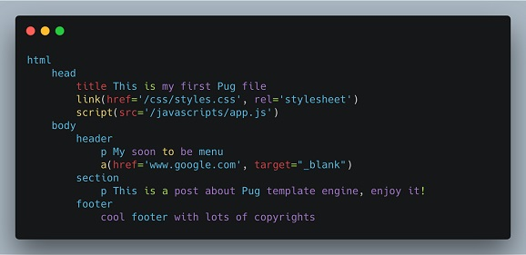
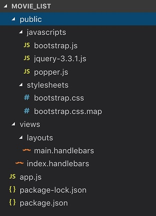
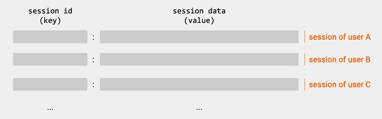
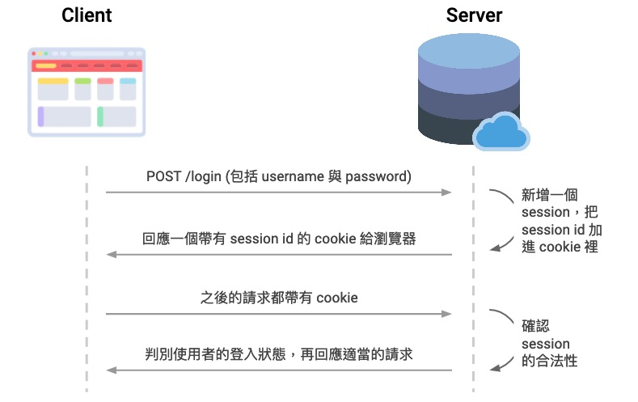
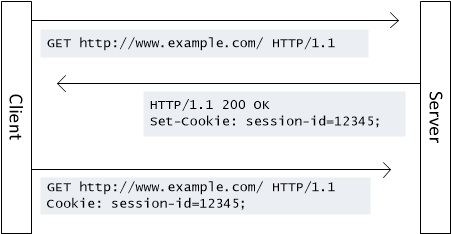
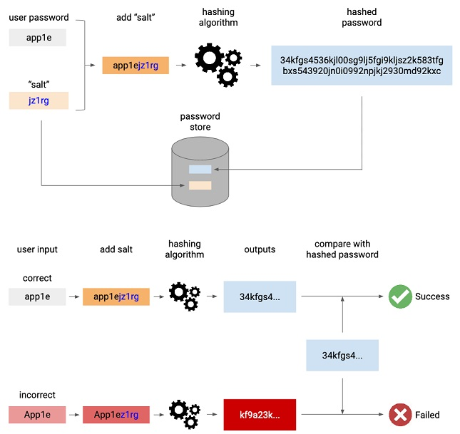

### 基本用法

```javascript
const express = require('express')
const app = express()
const port = 3000

// setting the route and corresponding response
// 可以用app.get、app.post、app.patch、app.put等RESTFUL api方式設定route
app.get('/', (req, res) => {
  // text/plain
  res.send(`This is my first Express Web App`)
  /**
    回傳檔案，注意，不能用相對路徑
    ❌ path.join('views', 'index.html')
    ✔️ path.join(__dirname, 'views', 'index.html')
   */
  res.sendFile('./views/index.html', { root: __dirname })
  res.sendFile(path.join(__dirname, 'views', 'index.html'))
})

// Listen the server when it started
app.listen(port, () => {
  console.log(`Express is running on http://localhost:${port}`)
}
```

#### 正規表達式規範路由

```javascript
/**
  可以用正規表達式規範路由
  ^ ➡️ start with
  & ➡️ end with
  | ➡️ or
  (.html)? 可選的extension
*/
app.get('^/old-page(.html)?', (req, res) => {
  // 302 by default
  res.redirect(301, '/new-page')
})

app.get('/*', (req, res) => {
  res.status(404).sendFile(path.join(__dirname, 'views', '404.html'))
})

// 這個寫法等同於app.get、app.put、app.post、app.delete的集和寫法
app.all('*', (req, res) => {
  res.status(404)
  if (req.accepts('html')) {
    res.sendFile(path.join(__dirname, 'views', '404.html'))
  } else if (req.accepts('json')) {
    res.json({ error: '404 Not Found' })
  } else {
    res.type('txt').send('404 Not Found')
  }
})
```

#### Chaining Route Handlers

```javascript
const one = (req, res, next) => {
  console.log('one')
  next()
}
const two = (req, res, next) => {
  console.log('two')
  next()
}
const three = (req, res) => {
  console.log('three')
  res.send('Finished!')
}
app.get('/chain(.html)?', [one, two, three])
```

### Params

```javascript
// 動態路由，用冒號+名詞設定，接著從request中的params取得
// :language就是param
app.get('/popular/languages/:language', (req, res) => {
  res.send(`<h1>${req.params.language} is a popular language</h1>`)
})
```

### Query

按下表單按鈕，會得到網址 localhost:3000/?keyword=xxxx，其中 keyword 對應 input tag 的 name 值

```html
<form action="/search">
  <input type="text" name="keyword" placeholder="Enter movie name to search..." value="{{keyword}}" />
  <button type="submit" id="search-button">Search</button>
</form>
```

```javascript
app.get('/search', (req, res) => {
  //  在這裡取得keyword的數值
  console.log(req.query.keyword)
})
```

### Middleware

使用`app.use(<Middleware>)`設定 Middleware

```javascript
const express = require('express')
const app = express()
const errorHandler = require('./middleware/errorHandler.js')

app.use(errorHandler)
```

```javascript title="middleware/errorhandler.js"
const fs = require('fs')
const { promises: fsPromise } = fs
const path = require('path')

/**
 * @param {string} msg
 * @param {'eventLog.txt' | 'reqLog.txt'} file
 */
const logEvents = async (msg, file = 'eventLog.txt') => {
  const content = `${new Date().toJSON()}\t${msg}\r`

  const logPath = path.join(__dirname, '..', 'logs', file)
  const { dir } = path.parse(logPath)

  if (!fs.existsSync(dir)) fs.mkdirSync(dir, { recursive: true })

  try {
    await fsPromise.appendFile(logPath, content)
  } catch (error) {
    console.error('logEvents ERROR:', error.message)
  }
}

const errorHandler = (err, req, res, next) => {
  logEvents(`${err.name}: ${err.message}`, 'errLog.txt')
  res.status(500).send(err.message)
}

module.exports = errorHandler
```

### 取得表單內容 - body-parser

使用 body 內的 json 做請求[(來源)](https://youtu.be/bJkRnvIT5jQ?list=PL4cUxeGkcC9h77dJ-QJlwGlZlTd4ecZOA&t=90)

```javascript
const express = require('express')
const app = express()
// 設定請求接受json檔案
app.use(express.json())

app.get('/search', (req, res) => {
  //  在這裡取得json內 keyword的數值
  console.log(req.body.keyword)
})
```

如果是 html 表單 form tag，需要安裝 body-parser

```javascript
const express = require('express')
const bodyParser = require('body-parser')
const app = express()
app.use(bodyParser.urlencoded({ extended: true }))

app.post('/', (req, res) => {
  // 在這裡取得表單內容objInForm
  const { body: objInForm } = req
})
```

也可以用 express 內建方法

```javascript
const express = require('express')
const app = express()

// built-in middleware to handle urlencoded data
// in other words, form data:
// ‘content-type: application/x-www-form-urlencoded’
app.use(express.urlencoded({ extended: false }))
```

### CORS 處理

```terminal
npm install cors
```

```javascript
const express = require('express')
const app = express()
const cors = require('cors')

// Cross Origin Resource Sharing
const whitelist = ['https://www.yoursite.com', 'http://127.0.0.1:5500', 'http://localhost:3500']

const corsOptions = {
  origin: (origin, callback) => {
    if (whitelist.indexOf(origin) !== -1 || !origin) {
      callback(null, true)
    } else {
      callback(new Error('Not allowed by CORS'))
    }
  },
  optionsSuccessStatus: 200,
}
app.use(cors(corsOptions))
```

### 樣板引擎 handlebars

「樣板引擎」 (template engine) ，或譯成「模板引擎」，是一個網路開發者用來產生前端網頁的工具。樣板引擎會把帶有 HTML 內容的「樣板檔案」 (template files) 轉換成真正的 HTML 檔案 (再回應到瀏覽器上

在 Express 中有許多不同的樣板引擎可以使用。其中， PUG (原名 Jade) 是 Express 預設、並有許多人使用的樣板引擎。在 PUG 中，省略了原本 HTML 中角括弧的用法，並改變了原本的架構：



handlebars 基本設定，要怎麼用，請參考[官方文件](https://www.npmjs.com/package/express-handlebars)

```javascript
// app.js
const express = require('express')
const app = express()

// require express-handlebars here
const { engine } = require('express-handlebars')
app.engine('handlebars', engine())
app.set('view engine', 'handlebars')
// 設定handlebar取得express靜態資源檔案，檔案位置在./public中
app.use(express.static('public'))
// 或者設定絕對路徑
app.use(express.static(path.join(__dirname, '/public')))
```

需要設定一個 views 資料夾，裡面有 layouts 資料夾，放著主畫面 html main.handlebars

```handlebars
<!-- ./views/layouts/main.handlebars -->

<html lang='en'>
  <head>
    <meta charset='UTF-8' />
    <meta name='viewport' content='width=device-width, initial-scale=1.0' />
    <meta http-equiv='X-UA-Compatible' content='ie=edge' />
    <title>Document</title>
  </head>
  <body>
    <!-- handlebars會把partial templates取代{{{body}}}，例如下面的index.handlebars -->
    {{{body}}}
  </body>
</html>
```

views 底下放著 partial templates

```handlebars
<!-- ./views/index.handlebars -->
<h1>Create your own server with Node.js</h1>
```

在 express 中設定

```javascript
// app.js

app.get('/', (req, res) => {
  // 這邊指定顯示views/index.handlebars內容給客端
  res.render('index')
})
```

| 檔案名稱         | 功能                                                      |
| ---------------- | --------------------------------------------------------- |
| app.js           | 載入模組（例如 Express、Handlebars)、設定路由             |
| main.handlebars  | 定義全站的佈局 (layout)                                   |
| index.handlebars | 定義 index 頁面的局部樣板 (partials or partial templates) |

### 靜態檔案

```javascript
// app.js
const express = require('express')
const app = express()

// 設定handlebar取得express靜態資源檔案，檔案位置在./public中
app.use(express.static('public'))
```

例子，套用 bootstrap 的 CSS 與 JS 檔案



```handlebars
<!-- ./views/layouts/main.handlebars -->

<html lang='en'>
  <head>
    <!-- ... -->
    <!-- link css files here -->
    <link rel='stylesheet' href='/stylesheets/bootstrap.css' />
  </head>
  <body>
    <!-- ... -->
    <!-- include javascript files here -->
    <script src='/javascripts/jquery-3.3.1.js'></script>
    <script src='/javascripts/popper.js'></script>
    <script src='/javascripts/bootstrap.js'></script>
  </body>
</html>
```

:::note
Bootstrap 也可以透過 npm 下載，但因為 Node.js 在沒有 webpack 的情況下，算是後端的東西，所以雖然透過 npm 下載成功了，甚至也可以透過 require 的方式載入 Bootstrap 的 JS 檔，可是在前端的部分並無法直接使用 Bootstrap CSS 的檔案。你依然需要到 npm 下載下來的資料夾（node_modules）中去把 CSS 複製一份出來，再放到 server 的資料夾內。簡單來說，就是沒辦法直接 require bootstrap 的 CSS 檔（在沒有 webpack 的前提下），因此比較簡單的方式是：

- 直接從官網下載下來放到 public 資料夾中
- 直接用 Bootstrap CDN
:::

另外設定靜態檔案後，路徑就是絕對路徑，以下例子的 CSS 檔案位於`public/css/styles.css`

```html
❌ <link rel="stylesheet" href="../css/style.css" /> ✔️ <link rel="stylesheet" href="css/style.css" />
```

### 重構 RESTful 路由

html 因為只有支援 get 跟 post，所以要用[Method-override](https://www.npmjs.com/package/method-override)來支援 RESTful 路由

```javascript
const express = require('express')
const app = express()

const methodOverride = require('method-override')
// 這邊指定若帶有"_method"的query string，就把路由導向該query string指定的路由
app.use(methodOverride('_method'))
```

例子，指定 delete

```html
<form method="POST" action="/resource?_method=DELETE">
  <button type="submit">Delete resource</button>
</form>
```

### Express 路由器

原本的路由如下

```javascript
const express = require('express')
const app = express()

app.get('/todos', (req, res) => res.redirect('/'))
app.get('/todos/new', (req, res) => res.render('new'))
```

Express 中內建有一個名為「路由器 (Router)」 的 middleware 可以幫我們獨立處理路由與 controller action

```javascript title="routes/todo.js"
const express = require('express')
const router = express.Router()

// 這邊用express.Router()取代express()
router.get('/', (req, res) => res.redirect('/'))
router.get('/new', (req, res) => res.render('new'))

router.put('/:id', async (req, res) => {
  // redirect不受路由器預設路徑影響，所以這邊還是要帶上指定的根目錄
  res.redirect(`/todos/${req.params.id}`)
})

module.exports = router
```

輸出的 module 就可以載入

```javascript title="routes/todo.js"
const express = require('express')
const app = express()

// 載入路由器，注意這邊指定這個路由器的跟目錄是/todos，所以routes/todo.js的網址沒有帶todos
app.use('/todos', require('./routes/todo'))
```

此外，router 也可以用鏈式寫法

```javascript
const express = require('express')
const router = express.Router()
const data = {}
data.employees = require('../../model/employees.json')

router
  .route('/')
  .get((req, res) => {
    res.json(data.employees)
  })
  .post((req, res) => {
    res.json({
      firstname: req.body.firstname,
      lastname: req.body.lastname,
    })
  })
  .put((req, res) => {
    res.json({
      firstname: req.body.firstname,
      lastname: req.body.lastname,
    })
  })
  .delete((req, res) => {
    res.json({ id: req.body.id })
  })

router.route('/:id').get((req, res) => {
  res.json({ id: req.params.id })
})

module.exports = router
```

### MVC 架構

簡單而言，就是把內容拆分成三個類型

- Model：資料
- View： 畫面
- Controller：決定 router 處理內容

原本只有在 route 內處理

```javascript title="routes/api/employees.js"
const express = require('express')
const router = express.Router()
const data = {}
data.employees = require('../../model/employees.json')

router
  .route('/')
  .get((req, res) => {
    res.json(data.employees)
  })
  .post((req, res) => {
    res.json({
      firstname: req.body.firstname,
      lastname: req.body.lastname,
    })
  })
  .put((req, res) => {
    res.json({
      firstname: req.body.firstname,
      lastname: req.body.lastname,
    })
  })
  .delete((req, res) => {
    res.json({ id: req.body.id })
  })

router.route('/:id').get((req, res) => {
  res.json({ id: req.params.id })
})

module.exports = router
```

改為

```javascript title="controllers\employeesController.js"
const data = {
    employees: require('../model/employees.json'),
    setEmployees: function (data) { this.employees = data }
}

const getAllEmployees = (req, res) => {
  ...
}
const createNewEmployee = (req, res) => {
  ...
}
const updateEmployee = (req, res) => {
  ...
}
const deleteEmployee = (req, res) => {
  ...
}
const getEmployee = (req, res) => {
  ...
}

module.exports = {
  getAllEmployees,
  createNewEmployee,
  updateEmployee,
  deleteEmployee,
  getEmployee
}
```

```javascript title="routes/api/employees.js"
const express = require('express')
const router = express.Router()
const employeesController = require('../../controllers/employeesController')

router
  .route('/')
  .get(employeesController.getAllEmployees)
  .post(employeesController.createNewEmployee)
  .put(employeesController.updateEmployee)
  .delete(employeesController.deleteEmployee)

router.route('/:id').get(employeesController.getEmployee)

module.exports = router
```

### Express Session

在 Express 中使用 session 時，透過 middlewave 可以截取 cookie 資訊、生成 session 並把 session 資訊存放在伺服器端。

#### 安裝

```terminal
npm install express-session passport passport-local
```

```javascript title="app.js"
const session = require('express-session')

app.use(
  session({
    // secret: 定義一組屬於你的字串做為私鑰
    secret: 'your secret key',
    // 當設定為true時，會在每一次與使用者互動後，強制把 session 更新到 session store 裡。
    resave: false,
    // 強制將未初始化的 session 存回 session store。未初始化表示這個 session 是新的而且沒有被修改過，例如未登入的使用者的 session。
    saveUninitialized: true,
  })
)

const passport = require('passport')

// 使用 Passport
app.use(passport.initialize())
app.use(passport.session())
```

#### 套件 Passport

```javascript
// config/passport.js
const LocalStrategy = require('passport-local').Strategy
const pt = require('passport')
const mongoose = require('mongoose')

// 載入 User model
const User = require('../models/user')

/**
 * @param {pt} passport
 */
module.exports = (passport) => {
  // 使用 Passport 的官方文件上的語法
  passport.use(
    new LocalStrategy(
      // 定義 usernameField 為 email
      { usernameField: 'email' },
      async (email, password, done) => {
        const user = await User.findOne({ email })
        if (!user) {
          return done(null, false, { message: 'That email is not registered' })
        }
        if (user.password !== password) {
          return done(null, false, { message: 'Email or Password incorrect' })
        }
        return done(null, user)
      }
    )
  )

  // 成功登入後，把 user id 放進 cookie 內的 session，創立login session
  passport.serializeUser((user, done) => done(null, user.id))

  // 經過route觸發，透過 session 資料，取回擁有這個 login session 的使用者實例
  passport.deserializeUser((id, done) => {
    User.findById(id)
      .lean()
      .exec((err, user) => done(err, user))
  })
}
```

導入設定

```javascript
// app.js
app.use(session(...))

const passport = require('passport')
// 使用 Passport，注意順序上session()優先執行
app.use(passport.initialize())
app.use(passport.session())

// 載入 Passport config
require('./config/passport')(passport)

// 由於「現在登入的使用者」是會被頻繁存取的資訊
// 所以做一個叫req.user物件，以便方便地在view裡面獲取當下登入的使用者資訊。
app.use((req, res, next) => {
  //  設定共用變數給express-handlebars
  res.locals.user = req.user
  res.locals.isAuthenticated = req.isAuthenticated()
  next()
})
```

路由設定

```javascript
// routes/user.js
const express = require('express')
const router = express.Router()
const passport = require('passport')

// 這裡會得到一個middleware function，用來處理驗證問題
const authMiddleware = passport.authenticate(
  'local', // 使用 passport 認證
  {
    successRedirect: '/', // 登入成功會回到根目錄
    failureRedirect: '/users/login', // 失敗會留在登入頁面
  }
)

// 登入檢查
router.post('/login', authMiddleware)
```

設定好之後，passport 會在 middleware 提供驗證方式

```javascript
// config/auth.js
module.exports = {
  authenticated: (req, res, next) => {
    if (req.isAuthenticated()) {
      return next()
    }
    res.redirect('/users/login')
  },
}
```

直接引用到需要檢查 auth 的 route 上

```javascript title="routes/home.js"
const express = require('express')
const router = express.Router()
const Todo = require('../models/todo')

// 載入 auth middleware 裡的 authenticated 方法
const { authenticated } = require('../config/auth')

// 加入 authenticated 驗證
router.get('/', authenticated, (req, res) => {
  Todo.find({})
    .sort({ name: 'asc' })
    .exec((err, todos) => {
      if (err) return console.error(err)
      return res.render('index', { todos: todos })
    })
})
module.exports = router
```

此外 passport 也會提供登出方式，可以參考[這裡的寫法](https://stackoverflow.com/questions/72336177/error-reqlogout-requires-a-callback-function)

```javascript
// 登出
router.get('/logout', (req, res, next) => {
  req.logout((err) => (err ? next(err) : res.redirect('/users/login')))
})
```

#### session

一個擁有所有使用者即登入紀錄的**龐大物件**，這個物件裡都是 key-value pair，key 是 session id（有簡稱 sid)，value 是 session_data：



session_data 裡面會包括與使用者相關的資料，可能會是整個 user object，但更普遍的是只貯存 user id 來節省空間。
而存放這個 session 物件的地方，一般會稱為**session store**。它可能是在記憶體 (memory)，也有可能在資料庫。

#### cookie

Cookie 是瀏覽器內預設提供的功能，貯存 session id。有了這個功能，瀏覽器讓伺服器得以把 session id 保留在瀏覽器的 cookie 上。瀏覽器每次對伺服器發送請求時，都會附帶 cookie 資訊，於是伺服器就能透過 cookie 取得 session id，進而追蹤到瀏覽器的狀態，並取得該使用者的資料。

#### 我們是如何登入的？

在登入頁面輸入用戶名稱與帳號密碼並送出時，輸入的資料會傳送到這個網路服務的伺服器，驗證資料是否與資料庫中的用戶資料一致。如果一致的話，就能成功登入。

#### 登入之後又發生了什麼事？

在你成功登入的時候，也就是瀏覽器對伺服器發送第一次請求時，伺服器端會建立一個 session，並在你的瀏覽器 cookie 裡儲存一個 session id 變數。透過這個 session id，伺服器就知道你曾經成功登入過，而之後瀏覽時就能透過 cookie 裡的 session id 直接對應伺服器上的 session data，直接尋找有關你的資料，不需要你重新登入



我們可以用這張圖去理解，客戶端跟伺服器如何透過 cookie 與 session id 來維持雙方的互動。



#### Session 與安全性問題

如果你的 session id 被人盜取，然後他把他 cookie 中的 session id 修改成跟你一樣，他就可以在不需要登入的情況下，直接操作你的帳號。

為了防止這個情況發現，通常伺服器都會有檢測 session id 是否已被修改的功能，較普遍的方法就是透過「簽章 (signature)」。

首先在伺服器端，應用程式開發者會設定一個「密鑰 (secret)」。伺服器會使用這個 secret 跟要傳送出去的 session id 透過認證演算法整合，產生一組編碼。這組編碼會寫在 cookie 提供給瀏覽器。

當收到從瀏覽器回傳的 cookie 後，伺服器會使用只有它知道的 secret 去「簽章 (sign)」，也就是透過演算法把這段編碼還原成 session id。如果 cookie 中的 session id 被惡意篡改過，還原的結果就會發生錯誤，session 比對無效。

#### Session 的取消

1. 使用者在瀏覽器主動刪除 cookie 資料
2. 登出 (logout)，應用程式會同時刪掉 session
3. 應用程式設定了一個「失效時間 (timeout)」。如果客戶端上次使用 session 的時間超過這個失效時間時，伺服器就定義這個客戶端已經停止活動，然後把 session 刪除。

[白話 Session 與 Cookie：從經營雜貨店開始](https://medium.com/@hulitw/session-and-cookie-15e47ed838bc)
[MDN 有關 HTTP cookies 的說明](https://developer.mozilla.org/en-US/docs/Web/HTTP/Cookies)
HTTP 協議會被形容為 stateless 的協議，因為它不能傳達狀態。[這是 Wiki 針對 stateless 的解釋。](https://en.wikipedia.org/wiki/Stateless_protocol)

### 用 bcrypt 處理密碼

使用[bcrypt](https://www.npmjs.com/package/bcryptjs)雜湊

#### 運作原理-加密

1. 使用者密碼+隨機字串(salt,加鹽)組成字串
2. 由 1 的字串用湊演算法 (hashing algorithm)處裡
3. 2 產生的結果與 1 使用的 salt 貯存起來
4. 使用者輸入的密碼 + 加密存起來的 salt 使用湊演算法處理，驗證產生的結果是不是跟加密時產生的資料一致
5. 註：經過雜湊函式處理的字串是不能被還原的



#### 安裝與使用

```terminal
npm install bcryptjs
```

註冊時處理密碼

```javascript
const bcrypt = require('bcryptjs')

// 註冊檢查
router.post('/register', async (req, res) => {
  const { name, email, password, password2 } = req.body

  try {
    const user = await User.findOne({ email })
    // 檢查 email 是否存在
    if (user) {
      ...
    } else {
      // 如果 email 不存在就新增使用者
      // 新增完成後導回首頁
      const newUser = new User({
        name,
        email,
        password
      })

      // 產salt
      const salt = await bcrypt.genSalt(10)
      // 用salt雜湊產生hashed password
      const hash = await bcrypt.hash(newUser.password, salt)

      // 另一種寫法
      const hash = await bcrypt.hash(newUser.password, 10);

      // 密碼存起來
      newUser.password = hash
      await newUser.save()
      res.redirect('/')
    }
  } catch (error) {
    console.error('Error at:', error)
  }
})
```

登入時檢查密碼

```javascript
const bcrypt = require('bcryptjs')

passport.use(
  new LocalStrategy(
    // 定義 usernameField 為 email
    { usernameField: 'email' },
    async (email, password, done) => {
      const user = await User.findOne({ email })
      if (!user) return done(null, false, { message: 'That email is not registered' })
      const isMatch = await bcrypt.compare(password, user.password)
      return isMatch ? done(null, user) : done(null, false, { message: 'Email or Password incorrect' })
    }
  )
)
```

### JSON WEB TOKEN (JWT)

#### Access token (short time)

- 授權 (Authorization) 的時候送出
- 以 JSON 方式送到客端，客端會存放在記憶體當中
- 當客端關閉 APP，access_token 會自動消失
- 不應該存放在 local storage 或 cookie
- 客端以 access_token 發送 API ，向後端請求資源
- 後端會以 Middleware 驗證身分
- 客端請求 refresh token 時，後端會給予新的 access_token

if you fetch api with credentials include, you must check url if it is whitelisted and set Access-Control-Allow-Credentials to true. Also issue refresh token with sameSite `None`, secure `true`

```javascript
// 回傳response時，自動在客端設定名微jwt的cookie，值是refreshToken，之後只要客端不清除cookie，發送的API都會自動帶上refreshToken
res.cookie('jwt', refreshToken, { httpOnly: true, sameSite: 'None', secure: true, maxAge: 24 * 60 * 60 * 1000 })
// 回傳response，同時清除客端jwt
res.clearCookie('jwt', { httpOnly: true, sameSite: 'None', secure: true })
```

#### Refresh token (long time)

- 授權 (Authorization) 的時候送出
- 以 httpOnly cookie 形式送出 (httpOnly = 無法直接經由 JavaScript 存取使用者的 session cookie)
- 後端會以 Middleware 驗證身分
- 登出這行為等同於清除後端對使用者紀錄的 refresh token，以及清除客端的 access token

#### 安裝

```terminal
npm i cookie-parser dotenv jsonwebtoken
```

#### 送出 JWT

```javascript title="controllers\authController.js"
const jwt = require('jsonwebtoken')
require('dotenv').config()

const handleLogin = async (req, res) => {
  const { user, pwd } = req.body
  if (!user || !pwd) return res.status(400).json({ message: 'Username and password are required.' })

  const foundUser = usersDB.users.find((person) => person.username === user)
  if (!foundUser) return res.sendStatus(401) //Unauthorized

  // evaluate password
  const match = await bcrypt.compare(pwd, foundUser.password)
  if (match) {
    // create JWTs
    const accessToken = jwt.sign({ username: foundUser.username }, process.env.ACCESS_TOKEN_SECRET, { expiresIn: '30s' })
    const refreshToken = jwt.sign({ username: foundUser.username }, process.env.REFRESH_TOKEN_SECRET, { expiresIn: '1d' })

    // Saving refreshToken with current user
    const otherUsers = usersDB.users.filter((person) => person.username !== foundUser.username)
    const currentUser = { ...foundUser, refreshToken }
    usersDB.setUsers([...otherUsers, currentUser])
    await fsPromises.writeFile(path.join(__dirname, '..', 'model', 'users.json'), JSON.stringify(usersDB.users))

    // set refresh token cookie
    res.cookie('jwt', refreshToken, { httpOnly: true, sameSite: 'None', secure: true, maxAge: 24 * 60 * 60 * 1000 })
    res.json({ accessToken })
  } else {
    res.sendStatus(401)
  }
}
```

#### 驗證 JWT

```javascript title="controllers\refreshTokenController.js"
const jwt = require('jsonwebtoken')
require('dotenv').config()

const handleRefreshToken = (req, res) => {
  const { cookies } = req
  if (!cookies?.jwt) return res.sendStatus(401)

  const refreshToken = cookies.jwt
  const foundUser = usersDB.users.find((person) => person.refreshToken === refreshToken)
  if (!foundUser) return res.sendStatus(403) //Forbidden

  // evaluate jwt
  jwt.verify(refreshToken, process.env.REFRESH_TOKEN_SECRET, (err, decoded) => {
    if (err || foundUser.username !== decoded.username) return res.sendStatus(403)
    const accessToken = jwt.sign({ username: decoded.username }, process.env.ACCESS_TOKEN_SECRET, { expiresIn: '30s' })
    res.json({ accessToken })
  })
}
```

```javascript title="middleware\verifyJWT.js"
const jwt = require('jsonwebtoken')
require('dotenv').config()

const verifyJWT = (req, res, next) => {
  const authHeader = req.headers.authorization || req.headers.Authorization
  if (!authHeader?.startsWith('Bearer ')) return res.sendStatus(401)

  const token = authHeader.split(' ')[1]
  jwt.verify(token, process.env.ACCESS_TOKEN_SECRET, (err, decoded) => {
    if (err) return res.sendStatus(403) //invalid token
    req.user = decoded.UserInfo.username
    req.roles = decoded.UserInfo.roles
    next()
  })
}
```

#### 設定 cookie-parser

沒有設定的話，無法取得 client 端 request 自動帶上的 cookie。另外 client 端要用 fetch api 帶上 cookie，需要設定`credentials: 'include'`，backend 需要設定`Access-Control-Allow-Credentials: true`

```javascript
// client side
const res = await fetch('http://localhost:3500/auth', {
  method: 'POST',
  body: JSON.stringify({
    user: getElValue('userInput'),
    pwd: getElValue('pwdInput'),
  }),
  headers: { 'content-type': 'application/json' },
  credentials: 'include',
})

const { accessToken } = await res.json()
```

```javascript title="middleware/credentials.js"
const allowedOrigins = ['https://www.yoursite.com', 'http://127.0.0.1:5500', 'http://localhost:3500']

const credentials = (req, res, next) => {
  const origin = req.headers.origin
  if (allowedOrigins.includes(origin)) {
    res.header('Access-Control-Allow-Credentials', true)
  }
  next()
}

module.exports = credentials
```

```javascript
const express = require('express')
const cookieParser = require('cookie-parser')
const credentials = require('./middleware/credentials')

// middleware for cookie
app.use(cookieParser())

// Handle options credentials check - before CORS!
// and fetch cookies credentials requirement
app.use(credentials)
```

### 用 FB 做第三方登入

略

### 取得隨機 secret

terminal 執行 node，接著執行以下程式碼

```console
require('crypto').randomBytes(64).toString('hex')
```

### 參考來源

> - [Node.js Full Course for Beginners | Complete All-in-One Tutorial | 7 Hours](https://www.youtube.com/embed/f2EqECiTBL8)
> - [Example](https://github.com/gitdagray/node_js_resources)
