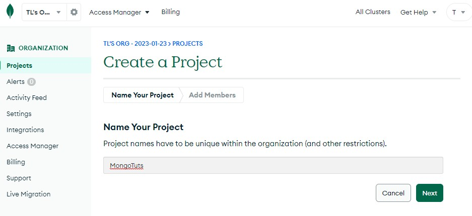

## 基本設定

01. 登入 MongoDB


01. 選擇新增 project


01. 設定 project - 1


01. 設定 project - 2，預設 project owner 會有存取權


01. 建立 data base - 1


01. 設定 data base - 2


01. 建立 data base 使用者，這邊紀錄帳號、密碼，後面會使用到


01. 新增 collection - 1


01. 新增 collection - 2


01. 新增 collection - 3


01. 新增 collection - 4


01. 新增 collection - 5，因為目前沒有實體位址，可以直接按下新增


01. 新增 collection - 6


01. 新增 collection - 7


01. 新增 collection - 8，複製這個連結，到 nodejs 作為連線網址


這個連線網址代表連接的 project、DB名稱，如果不提供DB名稱，預設DB名稱是`test`

```
mongodb+srv://<project>:<password>@cluster0.jjyae1q.mongodb.net/<database>?retryWrites=true&w=majority
```

01. 設定連線

```typescript title="src\config\dbConn.ts"
import mongoose from 'mongoose'

export async function connectDB() {
  try {
    if (!process.env.DATABASE_URI) throw Error('No DATABASE_URI available')
    
    await mongoose.connect(process.env.DATABASE_URI)
  } catch (error) {
    console.log(error)
  }
}
```

Project 啟動時連線
```typescript title="src\index.ts"
// external methods
import dotenv from 'dotenv'
import express from 'express'
import mongoose from 'mongoose'
import { connectDB } from './config/dbConn'

dotenv.config({
  path: path.join(__dirname, '..', '.env'),
})
const app = express()
connectDB()
const PORT = process.env.PORT || 3500

// ...

mongoose.connection.once('open', () => {
  console.log('Connected to MongoDB')
  app.listen(PORT, () => console.log(`Server running on port http://localhost:${PORT}`))
})

mongoose.connection.on('error', (err) => {
  console.log('MongoDB connection error:', err)
  const errorMsg = `${err.no}: ${err.code}\t${err.syscall}\t${err.hostname}`
  logEvents(errorMsg, 'mongoErrLog.log')
})
```

## Schema 建立

連接到 DB 後，會在該 DB 下主動建立 collection，以這個 Schema 做例子，就算沒有設定collection，創建的時候會主動設定名為 `users` 的 collection

```typescript
import mongoose, { Document, Schema } from 'mongoose'

interface IUser extends Document {
  username: string
  password: string
  roles: string[]
  active: boolean
}

const userSchema = new Schema<IUser>({
  username: {
    type: String,
    required: true,
  },
  password: {
    type: String,
    required: true,
  },
  roles: [
    {
      type: String,
      default: 'Employee',
    },
  ],
  active: {
    type: Boolean,
    default: true,
  },
})

const User = mongoose.model<IUser>('User', userSchema)

export default User
```
