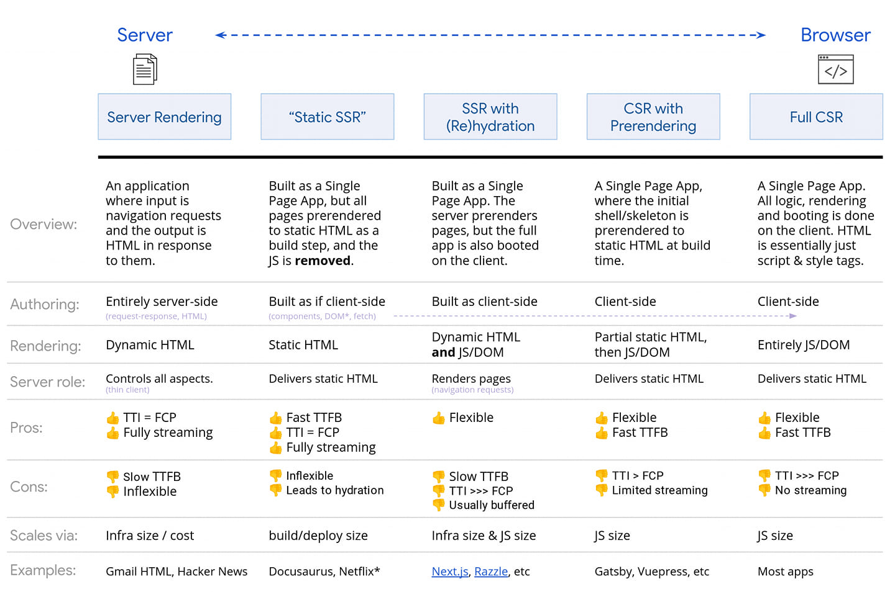

## 用 nodeJS 建立 server

### 基本用法

```javascript
const http = require('http')
const path = require('path')
const PORT = process.env.PORT || 3500

const server = http.createServer(async (req, res) => {
  // 設定回應的 HTTP 狀態碼 (status code)
  res.statusCode = 200
  // 設定回應的內容類型 (Content-Type)
  res.setHeader('Content-Type', 'text/plain')
  // 設定回應內容
  res.end('This is my first server created in Node.js')
})

server.listen(PORT, () => console.log(`Server listening on ${PORT}`))
```

### 回傳 HTML

```javascript
const server = http.createServer(async (req, res) => {
  res.statusCode = 200
  res.setHeader('Content-Type', 'text/html')
  res.end(`<h1>This is my first server created in Node.js</h1>`)
})
```

### 回傳資料

```javascript
const http = require('http')
const path = require('path')
const fs = require('fs')
const fsPromise = fs.promises

const server = http.createServer(async (req, res) => {
  const extension = path.extname(req.url)

  let contentType

  switch (extension) {
    case '.css':
      contentType = 'text/css'
      break
    case '.js':
      contentType = 'text/javascript'
      break
    case '.json':
      contentType = 'application/json'
      break
    case '.jpg':
      contentType = 'image/jpeg'
      break
    case '.png':
      contentType = 'image/png'
      break
    case '.txt':
      contentType = 'text/plain'
      break
    case '.ico':
      contentType = 'image/x-icon'
      break
    default:
      contentType = 'text/html'
  }

  const isHomePage = contentType === 'text/html' && req.url === '/'
  const isOtherHomePage = contentType === 'text/html' && req.url.slice(-1) === '/'
  const isOtherContentPage = contentType === 'text/html'

  let filePath = isHomePage
    ? path.join(__dirname, 'views', 'index.html')
    : isOtherHomePage
    ? path.join(__dirname, 'views', req.url, 'index.html')
    : isOtherContentPage
    ? path.join(__dirname, 'views', req.url)
    : path.join(__dirname, req.url)

  // makes .html extension not required in the browser
  if (!extension && req.url.slice(-1) !== '/') filePath += '.html'

  const fileExists = fs.existsSync(filePath)

  if (fileExists) {
    serveFile(filePath, contentType, res)
  } else {
    // 例外處理
    switch (path.parse(filePath).base) {
      case 'old-page.html':
        // 301 redirects
        res.writeHead(301, { Location: '/new-page.html' })
        res.end()
        break
      case 'www-page.html':
        res.writeHead(301, { Location: '/' })
        res.end()
        break
      default:
        serveFile(path.join(__dirname, 'views', '404.html'), 'text/html', res)
    }
  }
})

/**
 * @see https://jsdoc.app/tags-type.html
 * @typedef HttpResponse
 * @type {http.ServerResponse<http.IncomingMessage> & { req: http.IncomingMessage }}
 */

/**
 * @param {String} filePath
 * @param {String} contentType
 * @param {HttpResponse} response
 */
async function serveFile(filePath, contentType, response) {
  try {
    const isUtf8 = contentType.includes('image') ? '' : 'utf8'
    const isJson = contentType === 'application/json'
    const is404 = filePath.includes('404.html') ? 404 : 200

    const rawData = await fsPromise.readFile(filePath, isUtf8)
    const data = isJson ? JSON.parse(rawData) : rawData
    response.writeHead(is404, { 'Content-Type': contentType })
    response.end(isJson ? JSON.stringify(data) : data)
  } catch (error) {
    console.log(err)
    logEvents(`URL：${req.url}\tMETHOD：${req.method}`, 'reqLog.txt')

    // Internal Server Error
    response.statusCode = 500
    response.end()
  }
}
```

基本上瀏覽 SSR 網站，等同於在一個資料夾中尋找檔案，根據 route 的資訊提供對應的檔案；舉個例子

```html title="views/index.html"
<!DOCTYPE html>
<html lang="en">
  <head>
    <meta charset="UTF-8" />
    <meta http-equiv="X-UA-Compatible" content="IE=edge" />
    <meta name="viewport" content="width=device-width, initial-scale=1.0" />
    <title>index page</title>
    <!-- https://www.w3schools.com/html/html_favicon.asp -->
    <link rel="icon" type="image/x-icon" href="/public/favicon.ico" />
    <link rel="stylesheet" href="../css/style.css" />
  </head>
  <body>
    <div class="content">index page</div>
  </body>
</html>
```

可以看到兩個檔案的請求，根據網址要提供對應檔案

```html
<!-- project_folder/public/favicon.ico -->
<link rel="icon" type="image/x-icon" href="/public/favicon.ico" />
<!-- project_folder/css/style.css -->
<link rel="stylesheet" href="../css/style.css" />
```



> - [Node.js Full Course for Beginners | Complete All-in-One Tutorial | 7 Hours](https://www.youtube.com/embed/f2EqECiTBL8)
> - [HTML Favicon](https://www.w3schools.com/html/html_favicon.asp)
> - [@use JSDoc](https://jsdoc.app/tags-type.html)
> - [Rendering on the Web](https://web.dev/rendering-on-the-web/)
> - [對於 SSR 的思考與使用場景](https://blog.kalan.dev/2020-11-23-rethink-ssr)
> - [[教學] CSR 和 SSR 的差別是什麼? CSR 和 SSR 的超詳細比較!](https://shubo.io/rendering-patterns/)
